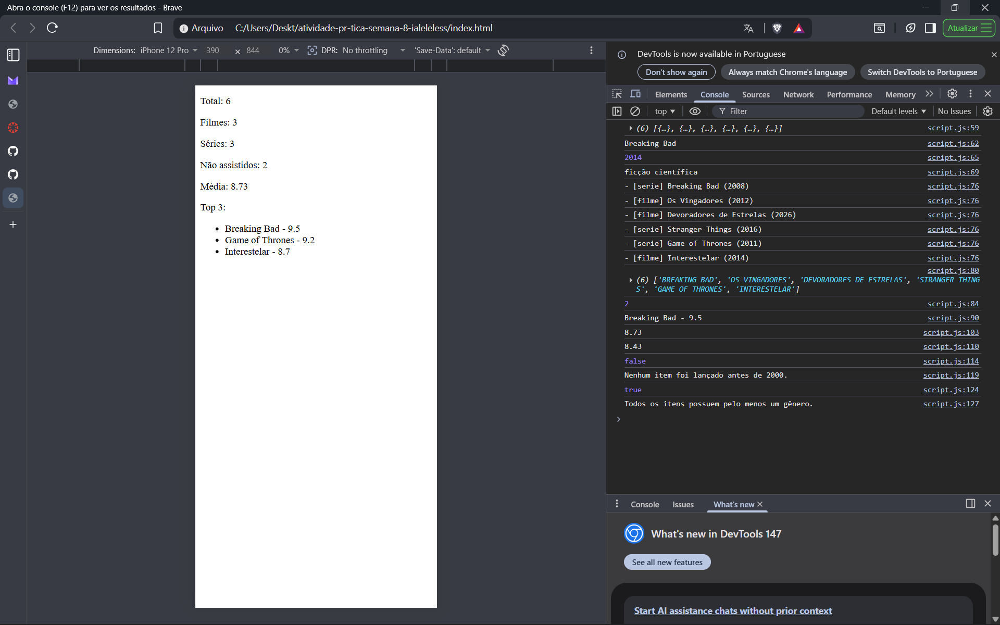

# Manipulação de Objetos e Arrays utilizando JSON

Nesta atividade, você fazer exercícios de programação para vai praticar a manipulação de objetos e arrays em JavaScript, passando pela definição de dados em notação JSON (JavaScript Object Notation), acessando propriedades e itens, e usando iterators para processar os dados e gerar resultados.

A atividade foi pensada para ser concluída em até 1h no laboratório, usando Visual Studio Code e um navegador (Console/DevTools).

## Informações Gerais

- Nome: Iale Leles de Almeida
- Matricula: 927707

## Print da listagem de títulos, cáculo das médias, resumo das checagens (some e every)

